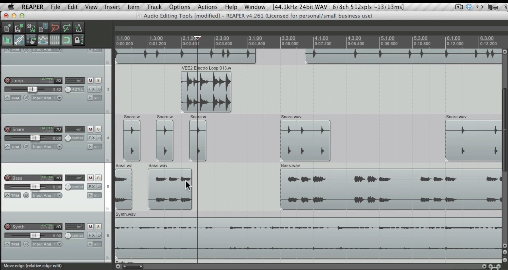

 

## What is Editing?

Editing is how we cut, arrange, and clean up audio to create a final sound piece. Back in the day, people had to physically cut and tape audio recordings together (imagine slicing film strips for a movie). Now, we can do everything digitally using a DAW (Digital Audio Workstation)—which makes editing faster, easier, and way more flexible.

Editing serves two big purposes:

- Creative Editing – Shaping the artistic vision of your piece.
- Technical Editing – Cleaning up the sound for clarity and professionalism.

 ## Creative Editing: The Art of Sound Design

This is where editing becomes part of the creative process. Instead of just fixing mistakes, you’re making artistic decisions—deciding when and how sounds happen in time.

Some key creative editing techniques include:

## Form  
How a piece is structured (for example, repeating sections like an ABA form).

- In lyrical writing it might look like this:
-  **A**  represents a Verse
-  **B**  represents the Chorus
-  ABA = Verse, Chorus, Verse

## Tension & Release 

Building up moments of anticipation and resolving them (common in music, film, and storytelling).

## Pacing  
Controlling the speed of events to set a mood (fast for excitement, slow for tension).

## Texture 

Deciding how many sounds should play at once (a busy, layered sound vs. a minimal, open sound).

Think of creative editing like arranging pieces of a puzzle to tell a story with sound.

 ## Technical Editing: Making Sound Clean & Clear
 
While creative editing is about what sounds good artistically, technical editing is about what sounds good technically. It helps remove distractions and makes sure everything fits together smoothly.

Some key technical editing tasks include:

## Removing Unwanted Noise 

- Cutting out breath sounds, hums, clicks, and background noise.

## Fixing Timing Issues 

- Making sure beats, words, or sound effects line up correctly.

## Editing for Length

- Adjusting a piece to fit a time limit (important for radio, film, or podcasts).

## Improving Clarity

- Making sure the most important sounds stand out and aren’t drowned out by others.

Good editing makes sure the listener hears what’s important without distractions.

## How Editing & Mixing Work Together

Editing and mixing often overlap. Sometimes, while mixing (adjusting volume, panning, and effects), you might realize you need to re-edit something. The more you practice, the better you’ll get at knowing when to switch between these roles.

Editing is about shaping the sound. Mixing is about balancing it. Together, they make your final product polished and professional.

## For this week:
- I want you to continue working with this same tool palette. Instead, I want you to focus on the new tools that will be introduced in the mixing proceeding pages on mixing.

<!-- kt 

<iframe class="embed-responsive-item" src="https://www.youtube.com/embed/VeD2uCE-14Q" frameborder="0" allow="accelerometer; autoplay; encrypted-media; gyroscope; picture-in-picture" allowfullscreen></iframe>

**_Editing_** is one of the processes that is potentially easier now in the DAW-based studio, than was possible in the tape-based studios of the 20th century. **_Editing_** is the process of cutting, splicing, and arranging audio sections in relationship to time and each other. As you have already experienced, the modern DAW allows for great control and flexibility in the editing process.

As discussed on the previous page, while we are working on the creation of our own, original sonic artworks, we are going to distinguish between creative editing (towards the goal of making art works) and technical editing (with the goal of cleaning an artwork).

# Editing for Creative Processes

When we talk about editing for creative processes, we are actually talking about composing and creating. This is where you, as an artist/musician/creator/etc. create relationships between sonic events and time.

This above statement is, in many ways, an understatement. During the creative editing process, you as a sonic artist, are directly involved in creation, composition, devising, making, etc. This is a magical and almost sacred activity. During this process, this is an opportunity for you to consider the emergent qualities of a work of art, the aesthetic goals and directions, and any meaning or experiences you may want to convey.

We will dig into the creative process more over the remainder of this semester, as well as future classes in sonic art, media art, music technology, and visual art. However, some of the broad qualities you may want to start to consider are;

## Form

The form of a time-based artwork refers to how large building blocks unfold and progress in time. The following image is a basic example of an ABA (pronounced, 'A'-'B'-'A'). In this type of form, an opening section is typically repeated after a middle section.

For a listener, this type of form offers them an aural roadmap of sorts. They will likely recognize the re-presentation of material after having already heard it once. For the artist, this offers you an opportunity to have a listener understand a piece with a traditional structure. It also signals to both you and the listener that thoughts has been given to the importance of material, such that the 'A' material anchors the entire piece.

## Tension & Release

Another quality of time-based creation to consider during the editing phase is that if "Tension & Release".

Tension & Release is a technique that is common in all art forms. Essentially, the artist works to create the anticipation of tension within the listener/viewer/participant, this anticipation is of that eventual _release_. Specifically, how and when will tension be released. There are many ways of creating tension and release, this may be something you want to consider, while developing your works this semester.

## Pacing

The pace or speed at which a work develops or unfolds over time is also something that you would want to consider during the creative editing phase.

Pacing may include things such as;

- how quickly/slowly do events occur in time
- timing of events to each other

## Texture

Another quality of editing that is important to consider during the creative editing phase is that of texture. Things to consider are;

- how many sonic events occur at the same time, and how do they alter the texture?
- Does a moment need to be sparse (i.e. very few sonic events) or dense (i.e. multiple simultaneously occurring events)

## **_{ TODO: }_**

Please read the following article interview about similarities between music composition and sound design for film. As we start to think about a sonic-based creative process and sets of aesthetic criteria, we can utilize much of the conversation here to help contextualize the various processes.

- [Editing and Music Composition « digitalfilms](https://digitalfilms.wordpress.com/2018/11/22/editing-and-music-composition/)

# Editing for Technical Purposes

When editing for technical clarity, the techniques may be similar, but the purpose and desired outcomes are different. In this process, you are trying to create the cleanest and "best" representation of the artwork as you can.

## Remove Unnecessary Material

A large goal of editing is the removal of unnecessary material. Examples of unnecessary material are things like;

- audio without any material on it (resulting in the addition of unwanted background noise)
- coughs, sneezes, or other non meaningful material from field/studio recording
- mouth clicks, pops, and breathes in spoken, voiced, or sung material
- background noise, hums, buzzes, pops, clicks, etc.
- distortion caused from improper gain levels

## Editing for Timing

One common task in editing is the adjustment of individual sonic events timing. This will include both the timing relationship of events to each other, as well as when we are thinking about western-style music, the relationship of timing to a metronome.

More specifically, during this process, you may find yourself adjusting the _onset_ of events, or when the start, so that events that are suppose to start together, actually start together. This will also include event releases, or when an event stops sounding. These too will often need to be adjusted so that they actually end together.

## Editing for Length

You may also find yourself needing to edit a work for length. This is especially true if you are producing something for radio, film, or TV, where you may have been given very specific length-timing specifications.

## Editing for Clarity

Another consideration in editing is sometimes around "clarity". Essentially, in this phase, the artist will ask themselves whether they are hearing the events/voices/sources that are most important, and whether the goal of the work is being achieved. If not, it may be necessary to remove some competing events/voices/sources in order to clean up the clarity of the work.

# Editing and Mixing

The relationship between the technical editing and technical mixing phases (much like the relationship between the creative editing and creative mixing phases) is sometimes blurred. The processes with more clarity between them should really be between the **_creative phase_** and the **_technical phase_**. You will likely move between the editing and mixing portions within the _creative_ or _technical_ phases. But you will likely make mixing or editing choices that will cause you to then need to move to the other. As you get more experience, you will get better at switching between these various "hats".

# Editing Tools

You have already been exposed to many of the tools you need for editing. This includes;

- the ability to move audio items around on the time line.
- the ability to split an audio item into multiple items
- the ability to splice items together in time
- the ability to delete portions of an audio item
-->

